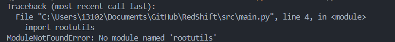

# LLM Jailbreaking


This isn't a bad error. It's just the llm failing to follow the instructions.

### Current TODO:  
Run it till the end


------
## Running locally:
### Create conda environment and activate it

```
conda create -n jailbreak python=3.10  
conda activate jailbreak
```

### Install dependencies
```
pip install torch torchvision torchaudio --index-url https://download.pytorch.org/whl/cu118
pip install -r requirements.txt
```


### Run script in git bash

Use this for gpu
```
python src/main.py --task-name "test"
```

Or this for cpu:
```
python src/main.py --task-name "test" --attack-device "cpu" --target-device "cpu" --judge-model-device "cpu"
```


If you get this error:


Do this:
```
conda deactivate
conda activate jailbreak
```
And the just run it again  

------------------------

