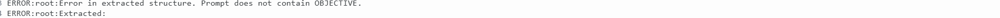

# LLM Jailbreaking


This isn't a bad error. It's just the llm failing to follow the instructions.

### Current TODO:  
Finish benchmarking 

------
## Running locally:
### Create conda environment and activate it

```
conda create -n jailbreak python=3.10  
conda activate jailbreak
```

### Install dependencies
```
pip install torch torchvision torchaudio --index-url https://download.pytorch.org/whl/cu118
pip install -r requirements.txt
```


### Run script in git bash

Use this for vicuna 7b attack and target
```
python src/main.py --task-name "vicuna-attack-target"
```

for running deepseek attack and target
```
python src/main.py --task-name "deepseek-attack-target" --attack-temperature "0.6"  --attack-model "deepseek-ai/DeepSeek-R1-Distill-Qwen-1.5B" --target-model "deepseek-ai/DeepSeek-R1-Distill-Qwen-1.5B" --target-temperature "0.6"
```

If one does not have a Nvidia gpu, simply add these commands to the run script:  

`--attack-device "cpu" --target-device "cpu" --judge-model-device "cpu"`


If you get this error:


Do this:
```
conda deactivate
conda activate jailbreak
```
And the just run it again  

------------------------

